# csvscope

Librairie générique pour comparer visuellement **des lots de CSV de séries temporelles**,
quand chaque fichier est une configuration et que ses caractéristiques sont inscrites dans
son nom.

Le but est d'éliminer le code jetable : au lieu de réécrire « je liste mes fichiers, je
décode le nom, je boucle, je trace, je mets en forme » à chaque nouvelle question posée aux
données, on charge le dossier une fois et chaque graphique interactif tient en une ligne.

```python
import csvscope as cs

ds = cs.load("mes_csv")                                   # noms de fichiers décodés
cs.save(ds.curves("temperature", color="maillage"), "temperature.html")
ds.report("rapport.html")                                 # rapport complet à onglets
```

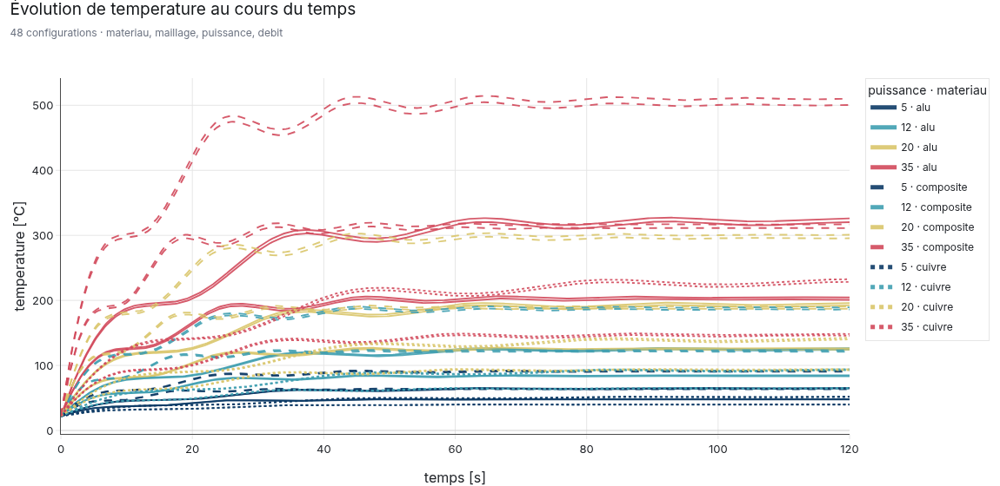

## Sommaire

- [Installation](#installation)
- [Le modèle : fichier = configuration](#le-modèle--fichier--configuration)
- [Lire les caractéristiques dans les noms de fichiers](#lire-les-caractéristiques-dans-les-noms-de-fichiers)
- [Prise en main sur des données artificielles](#prise-en-main-sur-des-données-artificielles)
- [Galerie de graphiques](#galerie-de-graphiques)
- [Interactions disponibles](#interactions-disponibles)
- [Sélectionner, dériver, agréger](#sélectionner-dériver-agréger)
- [Métriques scalaires](#métriques-scalaires)
- [Rapport HTML à onglets](#rapport-html-à-onglets)
- [Ligne de commande](#ligne-de-commande)
- [Recettes par question posée](#recettes-par-question-posée)
- [Tests](#tests)
- [Ancien script `radar_plot.py`](#ancien-script-radar_plotpy)

## Installation

```bash
pip install -e .            # ou : pip install -r requirements.txt
pip install -e ".[dev]"     # + pytest et kaleido (export PNG)
```

Dépendances : `pandas`, `numpy`, `plotly`. `kaleido` est nécessaire uniquement pour exporter
des images statiques.

## Le modèle : fichier = configuration

```
mes_csv/
  cas_materiau=alu_maillage=fin_puissance=20_debit=1p5.csv
  cas_materiau=cuivre_maillage=fin_puissance=20_debit=1p5.csv
  ...
```

| Notion | Où elle vit | Exemple |
| --- | --- | --- |
| **configuration** | un fichier CSV | `cas_materiau=alu_…` |
| **caractéristique** | le nom du fichier | `materiau`, `maillage`, `puissance`, `debit` |
| **grandeur** | une colonne du CSV | `temperature`, `contrainte`, `rendement` |
| **temps** | la colonne d'abscisse | `temps` (détectée automatiquement) |

`cs.load()` renvoie un `Dataset` qui contient les séries de chaque configuration et un
tableau `meta` avec une ligne par configuration. Les unités écrites dans les en-têtes
(`temperature [°C]`) sont extraites et réutilisées sur les axes.

```python
ds = cs.load("mes_csv")
print(ds.overview())
```

```
48 configurations · colonne de temps : 'temps'

Caractéristiques :
  - materiau (3) : alu, composite, cuivre
  - maillage (2) : fin, moyen
  - puissance (4) : 5, 12, 20, 35
  - debit (2) : 0.6, 1.5

Grandeurs :
  - temperature [°C]
  - pression [bar]
  ...
```

## Lire les caractéristiques dans les noms de fichiers

Quatre stratégies, de la plus automatique à la plus libre :

```python
# 1. Détection automatique : cle=valeur, cle:valeur, et jetons collés (P35, dt0p01, re1e6)
ds = cs.load("mes_csv")

# 2. Gabarit lisible, sans écrire de regex
ds = cs.load("mes_csv", template="essai_{materiau}_{maillage}_P{puissance}_Q{debit}")

# 3. Expression régulière à groupes nommés
ds = cs.load("mes_csv", regex=r"^(?P<materiau>[a-z]+)-(?P<puissance>\d+)kW$")

# 4. Fonction Python
ds = cs.load("mes_csv", parser=lambda nom: {"cas": nom.split("_")[1]})
```

Conversions appliquées automatiquement :

| Dans le nom | Valeur obtenue | Remarque |
| --- | --- | --- |
| `puissance=20` | `20` (entier) | |
| `debit=1p5` | `1.5` (flottant) | le `p` remplace souvent le point décimal |
| `re=1e6` | `1000000.0` | notation scientifique |
| `alpha15deg` | `alpha=15` | l'unité `deg` est mémorisée à part |
| `actif=true` | `True` | |
| `alu` | `tag1="alu"` | jeton non identifié, renommable |

Options utiles : `rename={"P": "puissance"}`, `casters={"puissance": float}`,
`strict=True` (échoue si un nom ne correspond pas au motif), et
`label="{materiau} · {puissance} kW"` pour l'étiquette lisible utilisée dans les légendes,
les survols et les tableaux.

## Prise en main sur des données artificielles

Une campagne artificielle complète est fournie : 48 configurations d'un refroidissement de
module de puissance (transitoire thermique, contrainte mécanique, rendement, vibrations).

```python
import csvscope as cs

ds = cs.demo_dataset()               # écrit les CSV puis les recharge
ds.curves("temperature", color="puissance", dash="materiau").show()
```

Le script de démonstration génère les données, toute la galerie et le rapport :

```bash
python examples/galerie_demo.py            # HTML dans examples/figures/
python examples/galerie_demo.py --png      # + captures PNG dans docs/images/
```

## Galerie de graphiques

Toutes les fonctions existent en méthode (`ds.curves(...)`) et en fonction
(`cs.curves(ds, ...)`), et renvoient une figure Plotly modifiable avant sauvegarde.

### Courbes superposées

```python
ds.curves("temperature", color="puissance", dash="materiau")
```

Deux caractéristiques encodées à la fois : la couleur (échelle continue pour une
caractéristique numérique, palette qualitative sinon) et le style de trait. La légende
n'affiche qu'une entrée par groupe et reste cliquable.


### Planche de bord multi-grandeurs

```python
ds.grid(["temperature", "contrainte", "rendement", "vibration"], color="puissance")
```

Zoom et déplacement synchronisés sur l'axe des temps.

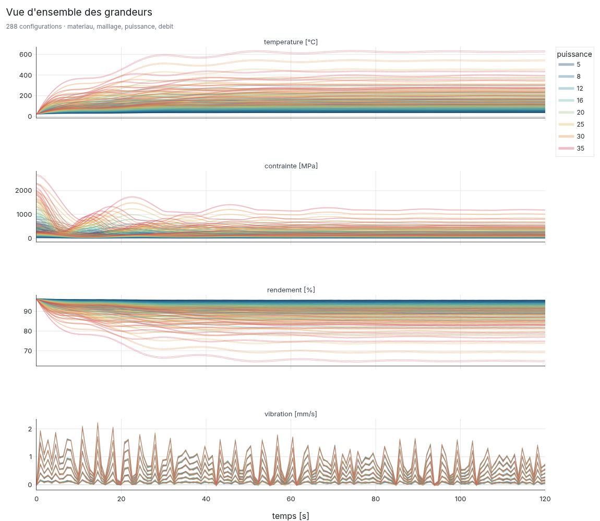

### Explorateur à menus

```python
ds.explorer(color="materiau")
```

Un seul fichier HTML, deux menus déroulants : la grandeur affichée et la caractéristique
portant la couleur. C'est la vue à privilégier pour explorer sans rien regénérer.

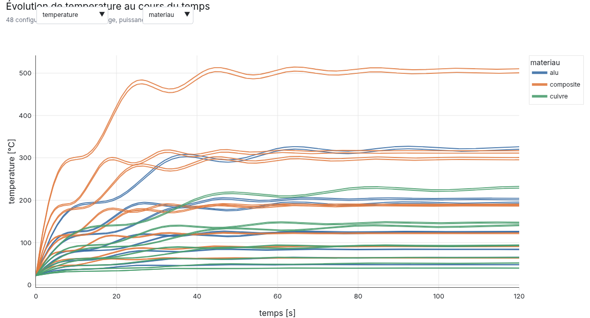

### Faisceau et dispersion

```python
ds.envelope("temperature", by="materiau", show_individual=True)   # band="std" pour ±1σ
```

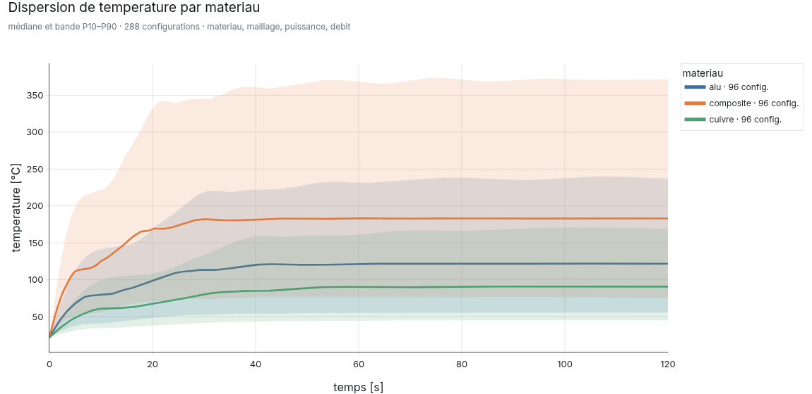

### Facettes

```python
ds.small_multiples("temperature", facet="materiau", color="puissance")
```

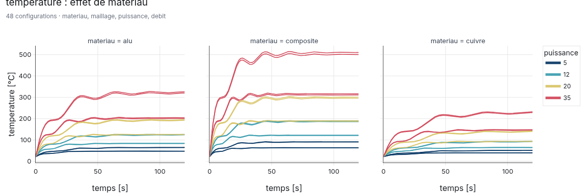

### Sensibilité à une caractéristique

```python
ds.compare("temperature", metric="max", x="puissance", color="materiau")
```

Moyenne par valeur de caractéristique, dispersion en barres d'erreur, et chaque
configuration en point survolable.

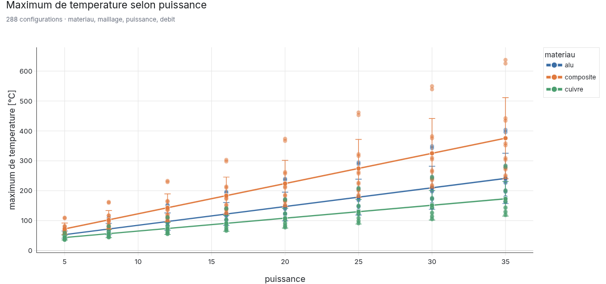

### Classement

```python
ds.bars("temperature", metric="max", color="materiau", top=15)
```

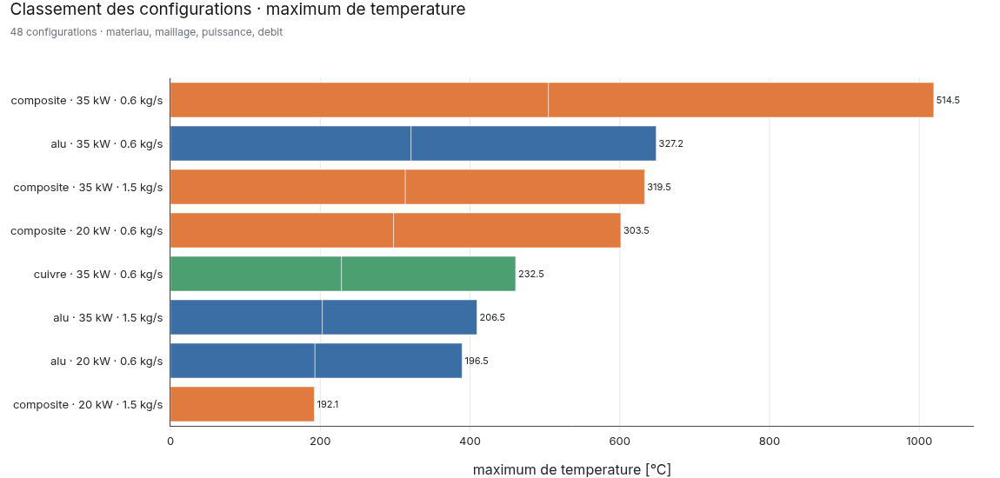

### Croisement de deux caractéristiques

```python
ds.heatmap("temperature", x="puissance", y="materiau", metric="max")
```

Les cases vides montrent aussi les combinaisons pas encore calculées.

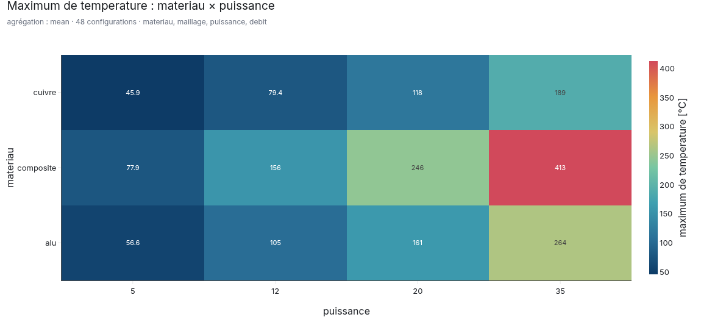

### Distribution

```python
ds.distribution("temperature", by="materiau", metric="max", kind="box")
# kind : "box", "violin", "strip", "hist", "ecdf"
```

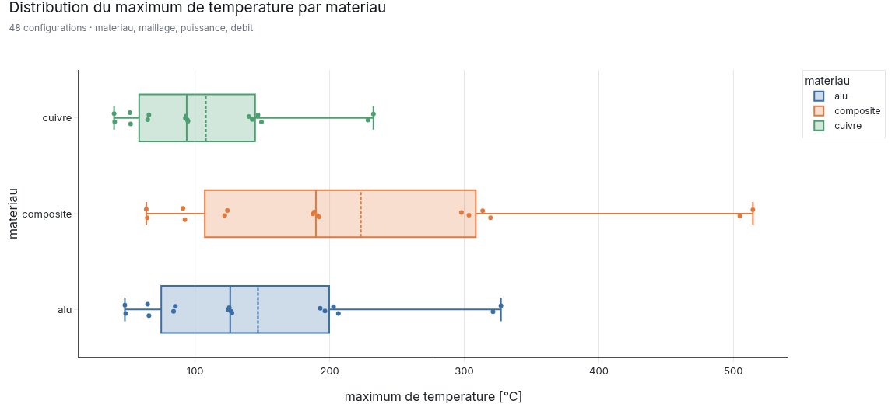

### Compromis entre deux grandeurs

```python
ds.scatter(("temperature", "max"), ("rendement", "mean"),
           color="materiau", size="contrainte", trend=True)
```

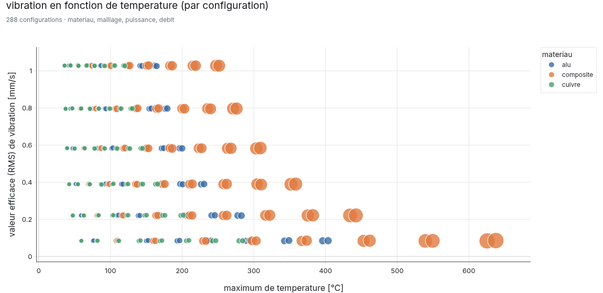

### Coordonnées parallèles

```python
ds.parallel(["temperature", "contrainte", "vibration", "rendement"],
            metric="max", color="puissance")
```

Glisser la souris le long d'un axe filtre les configurations : le moyen le plus direct de
répondre à « lesquelles tiennent plusieurs critères à la fois ? ».

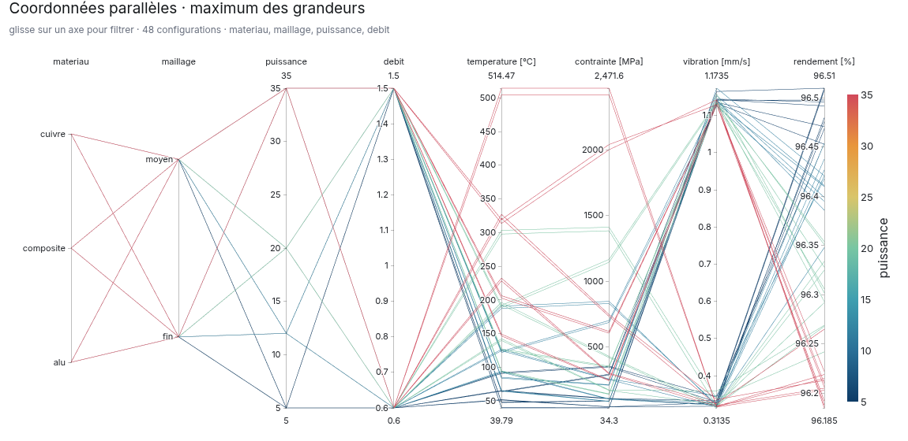

### Radar

```python
ds.radar(["temperature", "pression", "contrainte", "vibration", "rendement"],
         metric="max", group="materiau", normalize="minmax")
```

`normalize="max"` conserve les proportions, `"minmax"` accentue les écarts, `False` garde
les valeurs brutes. Le survol affiche toujours la valeur physique.

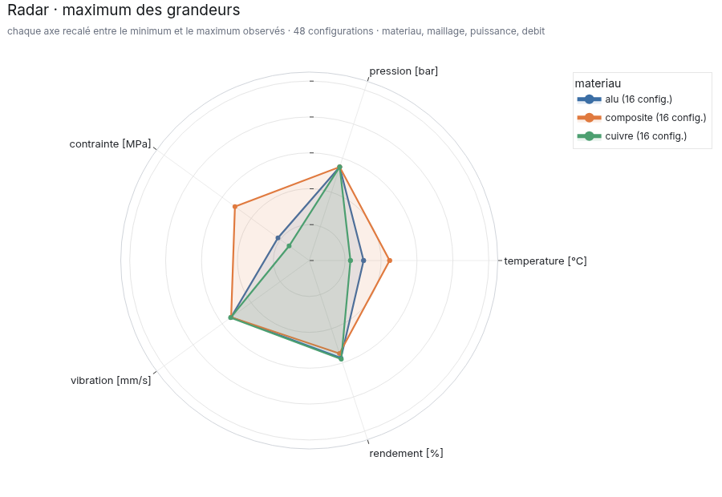

### Tableau récapitulatif

```python
cs.metrics_table(ds, ["temperature", "contrainte", "rendement"], metrics=("max", "mean"))
```

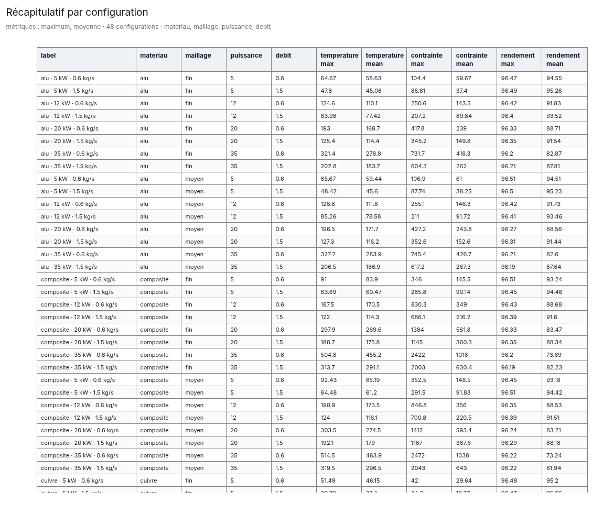

## Interactions disponibles

Sauvegarde d'une figure autonome :

```python
cs.save(fig, "figure.html")                      # plotly.js depuis le CDN (fichier léger)
cs.save(fig, "figure.html", include_plotlyjs=True)   # fichier autonome hors ligne
cs.show(fig)                                     # affichage direct (notebook, navigateur)
```

Le HTML produit ajoute, en plus du zoom et de la légende cliquable de Plotly :

| Geste | Effet |
| --- | --- |
| survol d'une courbe | la courbe passe au premier plan, les autres s'estompent |
| clic | verrouille la courbe mise en évidence |
| bouton `réinitialiser` | annule le verrouillage et le filtre |
| champ de filtrage | expression régulière sur l'étiquette des configurations |
| clic sur la légende | masque un groupe entier |
| glisser sur un axe (coordonnées parallèles) | filtre les configurations |

La mise en évidence porte sur la **configuration** et non sur la trace : dans une planche de
bord multi-grandeurs, survoler une courbe la met en avant dans tous les sous-graphiques.

Réglages : `interactivity=False` pour désactiver, ou
`interactivity={"dimOpacity": 0.05, "search": False}` pour ajuster.

## Sélectionner, dériver, agréger

```python
# Sélection : valeur, liste ou prédicat
fort = ds.filter(materiau="alu", puissance=[20, 35], debit=lambda v: v > 1.0)

# Grandeur calculée, appliquée à toutes les configurations
ds = ds.derive(marge="180 - temperature",
               flux=lambda df: df["debit_mesure"] * df["temperature"],
               units={"marge": "°C"})

# Caractéristique dérivée, pour regrouper autrement
ds = ds.add_characteristic(regime=lambda ligne: "fort" if ligne["puissance"] >= 20 else "faible")

# Tableau de métriques : une ligne par configuration
ds.table(["temperature", "contrainte"], ["max", "mean", "t_max"])

# Formats pandas classiques
ds.wide()      # toutes les séries concaténées + caractéristiques
ds.long()      # format long (config, caractéristiques, temps, quantity, value)
ds.resample(300)   # grille temporelle commune
```

Toutes ces méthodes renvoient un nouveau `Dataset` : les enchaîner ne modifie rien en place.

## Métriques scalaires

`max`, `min`, `mean`, `median`, `std`, `rms`, `range`, `final`, `initial`, `integral`,
`t_max`, `t_min`, `overshoot`, `slope`.

Une métrique maison s'ajoute par décorateur, puis s'utilise par son nom partout :

```python
@cs.register_metric("temps_seuil_150", "temps de franchissement de 150 °C")
def temps_seuil(valeurs, temps):
    depassement = temps[valeurs > 150]
    return float(depassement.iloc[0]) if len(depassement) else float("nan")

ds.compare("temperature", metric="temps_seuil_150", x="puissance", color="materiau")
```

Une fonction `(valeurs, temps) -> float` est aussi acceptée directement.

## Rapport HTML à onglets

```python
ds.report("rapport.html")                                    # analyse automatique
ds.report("rapport.html", quantities=["temperature", "contrainte"],
          x="puissance", color="materiau")
```

Le rapport automatique contient les onglets *Vue d'ensemble*, *Explorateur*,
*Comparaisons*, *Dispersion*, *Multi-grandeurs* et *Récapitulatif*.

Pour choisir soi-même les figures et les onglets :

```python
cs.build_report(
    {
        "Thermique": [ds.curves("temperature", color="puissance"),
                      ds.heatmap("temperature", x="puissance", y="materiau")],
        "Mécanique": ds.curves("contrainte", color="materiau"),
    },
    "rapport.html",
    title="Campagne de juin",
)
```

`plotlyjs="cdn"` allège fortement le fichier ; `"inline"` (défaut) le rend autonome.

## Ligne de commande

```bash
python -m csvscope infos mes_csv
python -m csvscope rapport mes_csv --sortie rapport.html --couleur maillage
python -m csvscope figure mes_csv --type curves --y temperature --couleur maillage
python -m csvscope demo --dossier donnees_demo --sortie rapport.html
```

Options communes : `--motif`, `--temps`, `--gabarit`, `--regex`, `--etiquette`, `--recursif`.

## Recettes par question posée

| Question | Code |
| --- | --- |
| Comment cette grandeur évolue-t-elle selon une caractéristique ? | `ds.curves("y", color="carac")` |
| Toutes mes grandeurs d'un coup ? | `ds.grid()` |
| Je veux fouiller librement | `ds.explorer()` |
| Quel est l'effet d'une caractéristique, tendance et dispersion ? | `ds.compare("y", x="carac")` |
| Quelles configurations sortent du lot ? | `ds.bars("y", top=15)` |
| Où en est ma campagne (combinaisons calculées) ? | `ds.heatmap("y", x="c1", y="c2")` |
| Mes maxima sont-ils dispersés ? | `ds.distribution("y", by="carac")` |
| Ma grandeur A se paie-t-elle en grandeur B ? | `ds.scatter("A", "B")` |
| Quelles configurations tiennent plusieurs critères ? | `ds.parallel(["A", "B", "C"])` |
| Quelle est la signature globale de chaque famille ? | `ds.radar(["A", "B", "C"], group="carac")` |
| Je veux tout envoyer à un collègue | `ds.report("rapport.html")` |

## Tests

```bash
python -m pytest
```

## Ancien script `radar_plot.py`

Le script `radar_plot.py` des premières versions est conservé tel quel (radar matplotlib
depuis un fichier Excel, distribution des maxima, courbes multi-CSV). Ses fonctionnalités
sont couvertes de façon plus générale par `csvscope` :

| `radar_plot.py` | Équivalent csvscope |
| --- | --- |
| `plot_radar_from_df` | `ds.radar([...], metric="max")` |
| `plot_csv_curves_interactive` | `ds.curves("y")` puis `cs.save(fig, "y.html")` |
| `analyze_max_distribution` | `ds.distribution("y", metric="max")` et `ds.table("y", "max")` |
